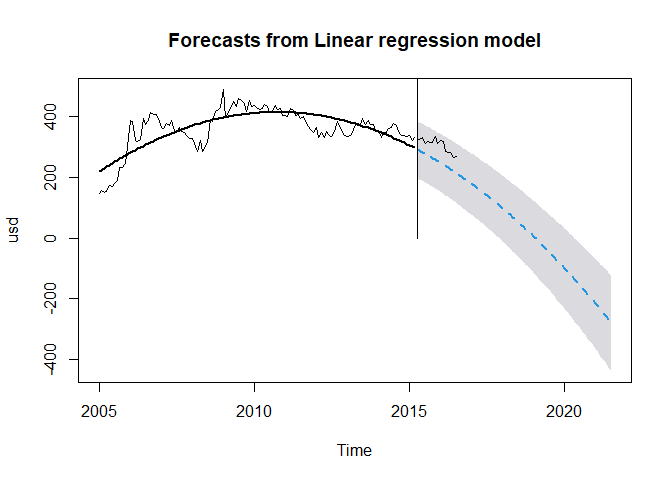

Sentiment_Analysis
================
Yeshil Bangera
2022-10-22

``` r
d <- read.csv("D:/END TO END/Business-Forecasting-Gold-Price/1979-2021.csv")
View(d)

d$Date <- format(as.POSIXct(d$Date,format='%d-%m-%Y'),format='%b-%Y')

head(d)
```

    ##       Date United.States.USD. Europe.EUR. Japan.JPY. United.Kingdom.GBP.
    ## 1 Jan-1979              233.7       144.8    45160.3               117.4
    ## 2 Feb-1979              251.3       154.6    50209.1               124.2
    ## 3 Mar-1979              240.1       148.0    50274.3               116.2
    ## 4 Apr-1979              245.3       152.8    54144.6               118.8
    ## 5 May-1979              274.6       172.0    61057.1               132.7
    ## 6 Jun-1979              277.5       169.0    60161.4               127.3
    ##   Canada.CAD. Switzerland.CHF. India.INR. China.CNY. Turkey.TRY.
    ## 1       267.1            379.3     1840.8         NA          NA
    ## 2       295.5            413.6     2011.7         NA          NA
    ## 3       278.2            406.2     1940.2         NA          NA
    ## 4       278.5            420.0     2013.1         NA          NA
    ## 5       321.6            478.0     2253.4         NA          NA
    ## 6       322.6            457.7     2190.6         NA          NA
    ##   Saudi.Arabia.SAR. Indonesia.IDR. United.Arab.Emirates.AED. Thailand.THB.
    ## 1             745.2       139739.3                     856.1        4511.3
    ## 2             827.8       154683.1                     946.6        4985.7
    ## 3             796.7       148844.2                     910.4        4812.9
    ## 4             819.4       152453.6                     930.2        4891.0
    ## 5             933.3       171656.1                    1048.4        5560.8
    ## 6             923.0       166854.4                    1049.8        5477.3
    ##   Vietnam.VND. Egypt.EGP. South.Korean.KRW. Australia.AUD. South.Africa.ZAR.
    ## 1           NA         NA          108235.8          197.2             194.5
    ## 2           NA         NA          119929.3          219.6             209.4
    ## 3           NA         NA          116123.6          214.6             202.4
    ## 4           NA         NA          117423.3          221.1             206.9
    ## 5           NA         NA          133889.6          250.7             233.7
    ## 6           NA         NA          133065.6          245.5             232.3

``` r
tail(d)
```

    ##         Date United.States.USD. Europe.EUR. Japan.JPY. United.Kingdom.GBP.
    ## 506 Feb-2021             1742.9      1435.9   185683.3              1246.6
    ## 507 Mar-2021             1691.1      1438.8   186861.0              1225.7
    ## 508 Apr-2021             1767.7      1468.4   193213.0              1276.7
    ## 509 May-2021             1900.0      1554.0   207845.0              1336.6
    ## 510 Jun-2021             1763.2      1486.8   195692.0              1276.3
    ## 511 Jul-2021             1825.8      1539.7   200376.1              1313.2
    ##     Canada.CAD. Switzerland.CHF. India.INR. China.CNY. Turkey.TRY.
    ## 506      2206.5           1577.8   128073.3    11258.8     12928.5
    ## 507      2125.4           1591.5   123639.0    11084.8     13995.6
    ## 508      2174.6           1612.2   130934.3    11439.4     14657.4
    ## 509      2295.3           1708.7   137979.1    12084.8     16105.4
    ## 510      2183.3           1629.8   131054.9    11392.5     15317.4
    ## 511      2279.2           1654.7   135863.2    11787.6     15376.5
    ##     Saudi.Arabia.SAR. Indonesia.IDR. United.Arab.Emirates.AED. Thailand.THB.
    ## 506            6536.6       24818185                    6401.8       52520.8
    ## 507            6342.1       24562502                    6211.5       52845.3
    ## 508            6628.9       25533703                    6492.8       55040.2
    ## 509            7125.4       27131285                    6978.3       59344.9
    ## 510            6612.5       25565674                    6476.3       56509.0
    ## 511            6847.3       26404909                    6706.3       60007.8
    ##     Vietnam.VND. Egypt.EGP. South.Korean.KRW. Australia.AUD. South.Africa.ZAR.
    ## 506     40114309    27362.8           1958092         2251.2           26397.6
    ## 507     39020980    26579.1           1913846         2220.3           24970.5
    ## 508     40753169    27681.4           1966245         2288.4           25644.2
    ## 509     43786247    29772.2           2110939         2454.6           26067.3
    ## 510     40580658    27672.6           1985571         2348.5           25175.6
    ## 511     41910091    28673.4           2100069         2483.8           26708.4

``` r
library(forecast)
```

    ## Warning: package 'forecast' was built under R version 4.1.3

    ## Registered S3 method overwritten by 'quantmod':
    ##   method            from
    ##   as.zoo.data.frame zoo

``` r
usd.ts <- ts(d$Europe.EUR., start = c(2005, 1), end = c(2016, 7), freq = 12)

train.ts <- window(usd.ts, start = c(2005, 1), end = c(2015, 3))
valid.ts <- window(usd.ts, start = c(2015, 4), end = c(2016, 7))
usd.lm <-  tslm(train.ts ~ trend + I(trend^2))
usd.lm
```

    ## 
    ## Call:
    ## tslm(formula = train.ts ~ trend + I(trend^2))
    ## 
    ## Coefficients:
    ## (Intercept)        trend   I(trend^2)  
    ##   211.29548      5.77912     -0.04141

``` r
usd.lm.pred <- forecast(usd.lm, h = 16, level = 0)
names(usd.lm.pred)
```

    ##  [1] "model"     "mean"      "lower"     "upper"     "level"     "x"        
    ##  [7] "series"    "method"    "newdata"   "residuals" "fitted"

``` r
#draw using training-period values and forecasts
plot(usd.ts, ylab = "usd", xlab = "Time")
lines(usd.lm.pred$fitted, lwd = 2)
lines(usd.lm.pred$mean, lwd = 2, lty=2)
lines(c(2015, 2015), c(0, 3500)) 
lines(c(2016.7, 2016.7), c(0, 3500))
text(2010, 600, "Training")
text(2016, 600, "Validation")
```

<!-- -->

``` r
#forecast accuracy measures
accuracy(usd.lm.pred$mean, valid.ts)
```

    ##                ME     RMSE      MAE      MPE     MAPE      ACF1 Theil's U
    ## Test set 51.59982 53.21873 51.59982 16.91793 16.91793 0.4475032  4.154805

``` r
#draw forecast errors
plot(usd.lm.pred$residuals, ylab = "Residuals", xlab = "Time", xlim = c(1979,2021))
#valid.ts-ridership.lm.pred$mean: forest errors in the validation period
lines(valid.ts - usd.lm.pred$mean, lwd = 1)
lines(c(2015.25, 2015.25), c(-500, 3500))
text(1996.25, 270, "Training")
text(2019.75, 270, "Validation")
```

<!-- -->

``` r
#histogram of forecast errors
hist(usd.lm.pred$residuals,  ylab = "Frequency", xlab = "Forecast Error")
```

<!-- -->

``` r
#forecasts and their 95% forecast intervals
usd.lm.pred.95 <- forecast(usd.lm, h=76, level = 95)
#draw training-period values and forecasts
plot(usd.lm.pred.95, ylab = "usd", xlab = "Time", flty = 2)
#trend line
lines(usd.lm.pred$fitted, lwd = 2)
#validation-period values
lines(valid.ts)
lines(c(2015.25, 2015.25), c(0, 3500)) 
text(1995, 1999, "Training")
text(2019, 1999, "Validation")
```

<!-- -->

``` r
#naive forecast
naive.pred<-naive(train.ts, h=72)
#seasonal naive forecast
snaive.pred<-snaive(train.ts, h=72)
accuracy(naive.pred,valid.ts)
```

    ##                      ME     RMSE      MAE        MPE     MAPE      MASE
    ## Training set   1.513115 23.16977 16.30820  0.4535103 4.641963 0.2876362
    ## Test set     -23.556250 31.95193 24.18125 -8.2698873 8.457972 0.4264974
    ##                    ACF1 Theil's U
    ## Training set -0.1092720        NA
    ## Test set      0.7017345  2.715347

``` r
accuracy(snaive.pred,valid.ts)
```

    ##                     ME     RMSE      MAE        MPE     MAPE      MASE
    ## Training set  16.48829 79.83280 56.69730   3.478526 15.14717 1.0000000
    ## Test set     -43.88125 53.41979 43.88125 -15.064087 15.06409 0.7739566
    ##                   ACF1 Theil's U
    ## Training set 0.8715442        NA
    ## Test set     0.6780196  4.483364

``` r
accuracy(usd.lm.pred$mean, valid.ts)
```

    ##                ME     RMSE      MAE      MPE     MAPE      ACF1 Theil's U
    ## Test set 51.59982 53.21873 51.59982 16.91793 16.91793 0.4475032  4.154805

``` r
library(zoo)
```

    ## Warning: package 'zoo' was built under R version 4.1.3

    ## 
    ## Attaching package: 'zoo'

    ## The following objects are masked from 'package:base':
    ## 
    ##     as.Date, as.Date.numeric

``` r
#trailing moving average
ma.trailing <- rollmean(train.ts, k = 12, align = "right")
last.ma <- tail(ma.trailing, 1)
#trailing moving average for forecasting
ma.trailing.pred <- ts(rep(last.ma, 36), start = c(2015, 4), end = c(2021, 7), freq = 12)

plot(usd.ts, ylim = c(200, 2600),  ylab = "USD", xlab = "Time", xlim = c(1979,2021.7))
lines(ma.trailing, lwd = 2) 
lines(ma.trailing.pred, lwd = 2, col = "blue", lty = 2) 
lines(c(2015.25, 2015.25), c(0, 3500)) 
text(1996.25, 2500, "Training")
text(2020, 2500, "Validation")
```

<!-- -->

``` r
par(mfrow = c(2,2))
plot(usd.ts, ylab = "usd", xlab = "Time", main = "usd")
#lag-12 differencing
plot(diff(usd.ts, lag = 12), ylab = "Lag-12", xlab = "Time", main = "Lag-12 Difference")
#lag-1 differencing
plot(diff(usd.ts, lag = 1), ylab = "Lag-1", xlab = "Time", main = "Lag-1 Difference")
#Twice differencing
plot(diff(diff(usd.ts, lag = 12), lag = 1), ylab = "Lag-12, then Lag-1", xlab = "Time", main = "Twice-Differenced (Lag-12, Lag-1)")
```

<!-- -->

``` r
dev.off()
```

    ## null device 
    ##           1

``` r
#exponential smoothing with alpha=.2
ses <- ets(train.ts, model = "ANN", alpha = 0.2)
#forecasts
ses.pred <- forecast(ses, h = 76, level = 0)
plot(usd.ts,ylab = "USD (Twice-Differenced)", xlab = "Time")
lines(ses.pred$fitted, lwd=2, col="blue")
lines(ses.pred$mean, lwd=2, lty=2, col="blue")
lines(c(2015.25, 2015.25), c(0, 3500)) 
text(1996.25, 1700, "Training")
text(2020, 1700, "Validation")
```

<!-- -->

``` r
#exponential smoothing without presetting the alpha
#the alpha is chosen automatically
ses.opt <- ets(train.ts, model = "ANN")
ses.opt.pred <- forecast(ses.opt, h = 76, level = 0)
#accuracy measures when alpha=.2
accuracy(ses.pred$mean, valid.ts)
```

    ##                 ME     RMSE      MAE       MPE     MAPE      ACF1 Theil's U
    ## Test set -32.13698 38.71452 32.13698 -11.09027 11.09027 0.7017345  3.245789

``` r
#accuracy measures when the alpha is chosen automatically
accuracy(ses.opt.pred$mean, valid.ts)
```

    ##                 ME     RMSE      MAE       MPE     MAPE      ACF1 Theil's U
    ## Test set -22.89384 31.46676 23.68445 -8.052162 8.290142 0.7017345  2.676731

``` r
#exponential smoothing with model=MAA
hwin <- ets(train.ts, model = "MAA")
#calculate forecasts
hwin.pred <- forecast(hwin, h = 76, level = 0)
plot(usd.ts,ylab = "usd", xlab = "Time")
lines(hwin.pred$fitted, lwd = 2, col = "blue")
lines(hwin.pred$mean, lwd = 2, lty=2, col = "blue")
lines(c(2015.25, 2015.25), c(0, 3500)) 
text(1996.25, 1700, "Training")
text(2020, 1700, "Validation")
```

<!-- -->

``` r
#exponential smoothing with parameters chosen automatically 
ets.opt <- ets(train.ts)
ets.opt.pred <- forecast(ets.opt, h = 76, level = 0)
plot(usd.ts,ylab = "usd", xlab = "Time")
lines(ets.opt.pred$fitted, lwd = 2, col = "blue")
lines(ets.opt.pred$mean, lwd = 2, lty=2, col = "blue")
lines(c(2015.25, 2015.25), c(0, 3500)) 
text(1996.25, 1700, "Training")
text(2020, 1700, "Validation")
```

<!-- -->
